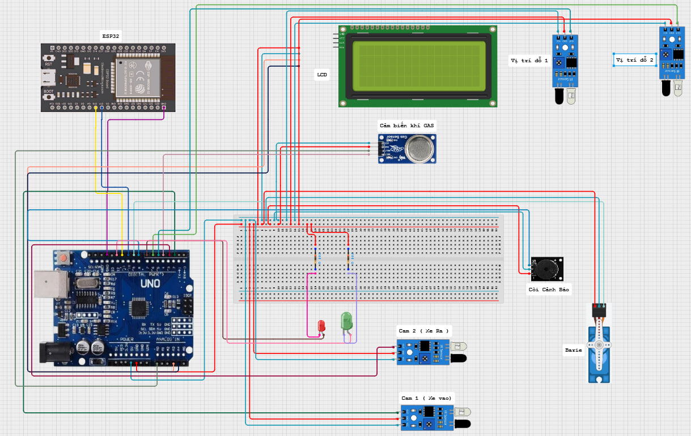
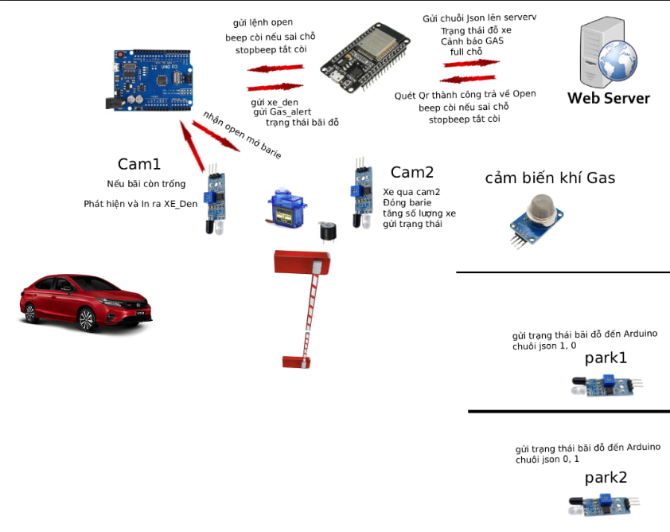

<h1 align="center">
🚗 Dự Án Nhận Diện Bãi Đỗ Xe Thông Minh Có Hệ Thống Giám Sát Online
</h1>

  

 

<h2 align="center">✨ Mô tả dự án</h2>

  Đây là dự án mô phỏng <strong>**BÃI ĐỖ XE THÔNG MINH CÓ GIÁM SÁT ONLINE**</strong> sử dụng **Arduino + ESP32**, kết hợp với **cảm biến hồng ngoại và cảm biến khí gas <strong>ESP32-CAM</strong>. Hệ thống hỗ trợ <strong> khách đặt chỗ trước qua QR code <strong>đồng thời có chức năng **cảnh báo khẩn cấp** khi phát hiện khí gas vượt ngưỡng.</strong>

<h2 align="center">🚀 Cấu trúc dự án</h2>
<pre>
📂 IOT
├── 📁 models/                   # Thư mục chứa các file xử lý dữ liệu (models, slots, người dùng)
├── 📁 node_modules/             # Thư viện được cài thông qua npm
├── 📁 public/                   # Tài nguyên tĩnh phục vụ frontend
│   ├── 🎨 admin-style.css       # Giao diện cho trang quản trị
│   ├── 📄 admin.html            # Giao diện dành cho admin
│   ├── 📄 index.html            # Giao diện dành cho khách hàng
│   └── 🎨 style.css             # CSS dùng chung cho giao diện người dùng
├── 📁 readme/                   # Thư mục chứa tài nguyên liên quan README
│   └── 🖼️ logoDaiNam.png        # Hình ảnh logo dự án
├── 📜 package.json              # Thông tin dự án & các dependencies
├── 📦 package-lock.json         # Khóa version các gói npm
├── 📄 server.js                 # File chính chạy backend Node.js + Express
├── 🔑 serviceAccountKey.json    # Khóa Firebase Admin (bảo mật – không chia sẻ)
├── 📘 README.md                 # Tài liệu mô tả dự án
└── 📝 readme.md                 # Tài liệu mô tả dự án
</pre>

## Chuẩn bị 
### 🛠️ Phần cứng

### 💻 Phần mềm

### 💻 Phần mềm sử dụng

<h2 align="center">📦 Các thư viện Node.js cần thiết</h2>

  <strong>Các gói cần cài đặt:</strong> 
  - express 
  - firebase-admin 
  - uuid  

  <strong>Cài các module cần thiết:</strong> 
 
  <code>npm install</code>  
  
  <strong>Lệnh cài thư viện:</strong> 
  - (Tùy chọn) Tạo môi trường ảo (nên dùng <code>nvm</code> hoặc <code>npm init</code>): 
  <code>npm init -y</code>  

  - Cài đặt các gói: 
  <code>npm install express firebase-admin uuid</code>  

  - <strong>Chạy server:</strong> 
  <code>node server.js</code>
  
<em>Lưu ý: Đảm bảo đã cấu hình đúng file <code>serviceAccountKey.json</code> trước khi chạy server.</em>

<h2 align="center">🧮 Bảng mạch</h2>

  ⛓️‍💥 <strong>Hướng dẫn cắm dây:</strong>

<h2 align="center">Cắm các thiết bị</h2>

  

<h4 align="center">📡 Cảm biến Gas</h4>

<table>
  <tr>
    <th>Thiết bị</th>
    <th>Chân</th>
    <th>Giá trị</th>
    <th>Ghi chú</th>
  </tr>
  <tr>
    <td>Cảm biến Gas</td>
    <td>VCC</td>
    <td>5V</td>
    <td>Cấp nguồn cho cảm biến</td>
  </tr>
  <tr>
    <td></td>
    <td>GND</td>
    <td>GND</td>
    <td>Nối đất</td>
  </tr>
  <tr>
    <td></td>
    <td>A0</td>
    <td>A0</td>
    <td>Đọc giá trị gas từ cảm biến (analog)</td>
  </tr>
</table>

 

<h4 align="center">🚗 Cảm biến xe (Cam1 & Cam2)</h4>

<table>
  <tr>
    <th>Thiết bị</th>
    <th>Chân</th>
    <th>Giá trị</th>
    <th>Ghi chú</th>
  </tr>
  <tr>
    <td>Cam1 (Cảm biến đầu vào)</td>
    <td>OUT</td>
    <td>D2</td>
    <td>Phát hiện xe vào</td>
  </tr>
  <tr>
    <td>Cam2 (Cảm biến đầu ra)</td>
    <td>OUT</td>
    <td>D3</td>
    <td>Phát hiện xe ra</td>
  </tr>
</table>

 

<h4 align="center">📍 Cảm biến vị trí đỗ (Park1 & Park2)</h4>

<table>
  <tr>
    <th>Thiết bị</th>
    <th>Chân</th>
    <th>Giá trị</th>
    <th>Ghi chú</th>
  </tr>
  <tr>
    <td>Park1</td>
    <td>OUT</td>
    <td>D5</td>
    <td>Phát hiện xe đỗ đúng vị trí đầu tiên</td>
  </tr>
  <tr>
    <td>Park2</td>
    <td>OUT</td>
    <td>D6</td>
    <td>Phát hiện xe đỗ đúng/sai ở vị trí thứ hai</td>
  </tr>
</table>

 

<h4 align="center">🧠 Kết nối Arduino & ESP32 (Giao tiếp Serial)</h4>

<table>
  <tr>
    <th>Arduino</th>
    <th>ESP32</th>
    <th>Chức năng</th>
  </tr>
  <tr>
    <td>D10 (TX)</td>
    <td>RX</td>
    <td>Truyền dữ liệu từ Arduino sang ESP32</td>
  </tr>
  <tr>
    <td>D11 (RX)</td>
    <td>TX</td>
    <td>Nhận dữ liệu từ ESP32</td>
  </tr>
</table>

<i>Sử dụng thư viện <code>SoftwareSerial</code> để giao tiếp giữa Arduino và ESP32</i>

 

<h4 align="center">🔩 Servo (Barie)</h4>

<table>
  <tr>
    <th>Thiết bị</th>
    <th>Chân</th>
    <th>Giá trị</th>
    <th>Ghi chú</th>
  </tr>
  <tr>
    <td>Servo</td>
    <td>VCC</td>
    <td>5V</td>
    <td>Cấp nguồn cho servo</td>
  </tr>
  <tr>
    <td></td>
    <td>GND</td>
    <td>GND</td>
    <td>Nối đất</td>
  </tr>
  <tr>
    <td></td>
    <td>Signal</td>
    <td>D9</td>
    <td>Điều khiển mở/đóng barie</td>
  </tr>
</table>

 

<h4 align="center">💡 Đèn LED trạng thái</h4>

<table>
  <tr>
    <th>LED</th>
    <th>Chân Arduino</th>
    <th>Màu</th>
    <th>Ghi chú</th>
  </tr>
  <tr>
    <td>LED Đỏ</td>
    <td>D7</td>
    <td>Đỏ</td>
    <td>Bật khi barie đóng hoặc hệ thống nguy hiểm</td>
  </tr>
  <tr>
    <td>LED Xanh</td>
    <td>D12</td>
    <td>Xanh</td>
    <td>Bật khi barie mở</td>
  </tr>
</table>

 

<h4 align="center">📟 Màn hình LCD I2C (20x4)</h4>

<table>
  <tr>
    <th>Thiết bị</th>
    <th>Chân</th>
    <th>Arduino</th>
    <th>Ghi chú</th>
  </tr>
  <tr>
    <td>LCD I2C</td>
    <td>VCC</td>
    <td>5V</td>
    <td>Cấp nguồn cho màn hình</td>
  </tr>
  <tr>
    <td></td>
    <td>GND</td>
    <td>GND</td>
    <td>Nối đất</td>
  </tr>
  <tr>
    <td></td>
    <td>SDA</td>
    <td>A4</td>
    <td>Dữ liệu I2C</td>
  </tr>
  <tr>
    <td></td>
    <td>SCL</td>
    <td>A5</td>
    <td>Clock I2C</td>
  </tr>
</table>

<h2 align="center">🚀 Hướng dẫn cài đặt và chạy</h2>

  <strong>1. Chuẩn bị phần cứng:</strong> 
  - Nạp mã Arduino: 
  &nbsp;&nbsp;&bull; Mở file <code>Arduino</code> bằng Arduino IDE. 
  &nbsp;&nbsp;&bull; Kết nối board Arduino với máy tính. 
  &nbsp;&nbsp;&bull; Nạp (upload) mã nguồn lên board. 
  &nbsp;&nbsp;&bull; Đảm bảo Arduino xuất hiện trên cổng COM. 
  - Nạp mã cho ESP32 với file <code>Esp32</code>.  
  <strong>2. CÀI ĐẶT PHẦN MỀM:</strong> 
  <strong>2.1 Cài đặt Arduino IDE:</strong> 
  &nbsp;&nbsp;&bull; Tải Arduino IDE tại: <a href="https://www.arduino.cc/en/software" target="_blank">Arduino Software</a>. 
  &nbsp;&nbsp;&bull; Cài đặt Driver CH340 nếu dùng board Arduino clone.  

  &nbsp;&nbsp;&bull; Cài đặt Driver CP210xVCP cho ESP32  

  <strong>2.2 Cài đặt thư viện cho Arduino:</strong> 

  &nbsp;&nbsp;&bull; Mở Arduino IDE → Library Manager (Ctrl + Shift + I), tìm và cài: 
  
  <code>Servo.h</code> (Điều khiển servo)
  
  <code>SoftwareSerial.h</code> (Giao tiếp nối tiếp giả lập để kết nối Arduino với ESP32 qua các chân digital (10 và 11).)
  
  <code>Wire.h</code> (Giao tiếp I2C dùng cho màn hình LCD I2C.)
  
  <code>LiquidCrystal_I2C.h</code> (Điều khiển màn hình LCD I2C (20x4).)

<h2 align="center">Hoạt động của hệ thống</h2>

  

  <strong>1️⃣ Khởi động hệ thống:</strong> 
  - Bật nguồn cho Arduino, ESP32 và máy tính. 
  - Mở Serial Monitor (9600 baud) trên Arduino IDE để theo dõi hoạt động. 
  - Mở Serial Monitor (115200 baud) trên ESP32 để theo dõi hoạt động. 
  - Chạy Web Server trên PC bằng lệnh: <code>node server.js</code>  
  <strong>Quy trình hoạt động:</strong> 
  - 1. Khởi động hệ thống 
    - Màn hình LCD hiển thị thông báo "Khởi động hệ thống". 
    - Barie ở trạng thái đóng (servo ở góc 0 độ). 
    - Các cảm biến và LED được thiết lập trạng thái ban đầu. 
  - 2. Phát hiện khí gas nguy hiểm 
    - Cảm biến khí gas (chân A0) liên tục đo giá trị khí trong không khí" 
    - Nếu giá trị vượt ngưỡng cao (gasThresholdHigh), hệ thống cảnh báo nguy hiểm: 
    - Mở barie (servo xoay góc 90 độ). 
    - Bật còi báo động. 
    - Gửi tín hiệu cảnh báo GAS_ALERT đến ESP32. 
    - LCD hiển thị trạng thái khí gas "Nguy hiểm" và barie "Mở (Gas)" và gửi thông báo về Telegram. 
    - Khi giá trị khí gas giảm dưới ngưỡng thấp (gasThresholdLow), hệ thống tắt cảnh báo, đóng barie, tắt còi, và LCD hiển thị trạng thái an toàn. 
    - 3. Phát hiện xe đến (Cảm biến Cam1) 
    - Khi cảm biến Cam1 (chân 2) phát hiện xe (tín hiệu LOW), nếu bãi chưa đầy:" 
    - Gửi tín hiệu "XE_DEN" cho ESP32 để yêu cầu quét QR. 
    - Barie giữ trạng thái đóng, LCD hiển thị "Đợi QR". 
    - Nếu bãi đã đầy theo dữ liệu đặt trước từ ESP32, còi sẽ báo hiệu từ chối xe. 
    - 4. Mở barie cho xe hợp lệ 
    - Khi nhận được lệnh open từ ESP32 (sau khi xác nhận QR hợp lệ), barie sẽ mở." 
    - Xe đi vào qua cảm biến Cam2 (chân 3). 
    - Khi xe qua Cam2 hoàn toàn, barie tự động đóng lại. 
    - Số xe trong bãi tăng lên 1, trạng thái được gửi về ESP32 và hiển thị trên LCD. 
    - 5. Xe ra khỏi bãi 
    - Khi phát hiện xe đi ra tại cảm biến Cam2 (và số xe > 0), barie sẽ mở." 
    - Xe đi qua cảm biến Cam1 ra khỏi bãi, barie đóng lại. 
    - Số xe trong bãi giảm 1, trạng thái gửi về ESP32 và cập nhật trên LCD. 
    - 6. Kiểm tra vị trí đỗ xe và còi cảnh báo 
    - Hai cảm biến đỗ xe (park1 và park2) theo dõi vị trí xe đỗ. 
    - Nếu xe đỗ sai vị trí (ví dụ park2 có xe nhưng số xe trong bãi chưa đủ 2), còi báo động sẽ được kích hoạt để cảnh báo. 
    - 7. Gửi trạng thái đỗ xe định kỳ 
    - Mỗi 5 giây, hệ thống gửi trạng thái chỗ đỗ xe (cảm biến park1, park2) về ESP32 để theo dõi và hiển thị. 
  - Arduino nhận kết quả và điều khiển động cơ, servo.

<h2 align="center">Giải thích code</h2>

  <strong>Arduino Code (arduino.ino):</strong> 
  - <em>Khởi tạo:</em> Khởi tạo Serial ở tốc độ 9600, cSử dụng các thư viện: Servo.h, SoftwareSerial.h, Wire.h, LiquidCrystal_I2C.h. Cấu hình các chân kết nối: Cảm biến xe (cam1, cam2): D2, D3. Cảm biến vị trí đỗ (park1, park2): D5, D6. Cảm biến gas: A0. Còi cảnh báo: D8. LED báo trạng thái: D7 (Đỏ), D12 (Xanh). Servo điều khiển barie: D9. Giao tiếp với ESP32 qua UART mềm (SoftwareSerial(10, 11)). Hiển thị thông tin qua màn hình LCD I2C (LiquidCrystal_I2C) 

  - <em>Vòng lặp chính:</em> -📡 Nhận dữ liệu cảm biến. Đọc giá trị khí gas từ analog A0. Đọc trạng thái cảm biến cam1, cam2 để xác định xe đến/đi. Đọc trạng thái cảm biến đỗ xe park1, park2 
  - <em>3. Xử lý dữ liệu & hành động</em> 
  &nbsp;&nbsp;&rarr; ☢️ Phát hiện khí gas: Nếu nồng độ gas vượt ngưỡng → mở barie, bật còi, gửi "GAS_ALERT" đến ESP32. Nếu gas giảm → đóng barie, tắt còi  
  &nbsp;&nbsp;&rarr; 🔐 Nhận lệnh từ ESP32: Nếu ESP32 gửi "open" → mở barie, cho xe vào. Nếu gửi "beep" → bật còi cảnh báo đỗ sai. Nếu gửi "stopbeep" → tắt còi  
  &nbsp;&nbsp;&rarr; 🚗 Xử lý xe vào (cam2). Khi xe đi qua cảm biến cam2 sau khi barie mở: Đóng barie. Tăng biến đếm soXe, gửi SOXE:x về ESP32 
  &nbsp;&nbsp;&rarr; 🅿️ Xử lý xe ra (cam2 → cam1). Khi có xe đi ra (cam2 LOW, rồi qua cam1): Mở barie. Giảm soXe, gửi SOXE:x về ESP32. Đóng barie sau khi xe đi qua  
  &nbsp;&nbsp;&rarr; 🚨 Kiểm tra đỗ sai: Nếu có xe ở park2 nhưng soXe < 2 → đỗ sai → bật còi cảnh báo. Nếu xe đỗ đúng hoặc đi khỏi → tắt còi  
  &nbsp;&nbsp;&rarr; 📤 Gửi trạng thái định kỳ: Gửi trạng thái chỗ đỗ xe (PARKING:x,y) mỗi 5 giây về ESP32  

  <strong>ESP32 (esp32.ino):</strong> 
  - <em>Khởi tạo:</em> Khởi tạo Serial ở tốc độ 115200, Kết nối WiFi (ssid = "....."). Cấu hình UART giao tiếp với Arduino (RX: D16, TX: D17). Thiết lập server: 
  
  POST /fromarduino → gửi dữ liệu.  
  
  GET /command → lấy lệnh từ server.  
  
  POST /commands/reset → reset lệnh 

  - <em>Vòng lặp chính:</em> -🔁 Nhận dữ liệu từ Arduino: Dữ liệu nhận dạng:  

  "GAS_ALERT" → gửi báo động gas lên server 

  "SOXE:x" hoặc "Tong xe: x" → cập nhật số xe 

  "PARKING:x,y" → cập nhật trạng thái các slot 

  - <em>3. Gửi dữ liệu lên server</em> 
  &nbsp;&nbsp;&rarr; Gửi định dạng JSON:  

  { 
  "event": "update", 
  "total": x, 
  "slots": [2, 0] 
  } 

  &nbsp;&nbsp;&rarr; ☢️ Nếu phát hiện "GAS_ALERT": 
  Gửi báo động lên server: 

  { 
  "event": "gas_alert", 
  "total": x, 
  "slots": [2, 0], 
  "gas": 300 
  } 

  &nbsp;&nbsp;&rarr; 4. Xử lý điều kiện còi cảnh báo. Nếu slot2 = 2 và slot1 ≠ 2 → đỗ sai → gửi "beep" cho Arduino (1 lần duy nhất). Nếu điều kiện không còn → tắt chế độ cảnh báo (beepSent = false) 

  &nbsp;&nbsp;&rarr; 5. Kiểm tra lệnh từ server: Gửi GET /command mỗi 3 giây. Nếu có "open": Gửi "open" về Arduino Gửi POST rỗng để reset lệnh trên server 
  <strong>Flask &amp; YOLO Code (web.py):</strong> 
  - <em>Khởi tạo:</em> Flask server khởi chạy tại <code>http://0.0.0.0:5000/</code> và tải mô hình YOLO từ file <code>best.pt</code>. 
  - <em>Xử lý ảnh:</em> Lấy ảnh từ ESP32-CAM qua URL, chạy YOLO để nhận diện đối tượng (quả cam tươi/hỏng), cập nhật ảnh annotate và kết quả phân loại. 
  - <em>Giao tiếp với Arduino:</em> Khi nhận lệnh "CHECK" qua Serial, Flask sẽ chụp ảnh mới, xử lý và gửi kết quả ("ô tô", "đồ chơi" hoặc "unknown") về Arduino. 
  - <em>Giao diện web:</em> Hiển thị video feed từ camera, thông tin FPS, trạng thái camera và cảnh báo.

<h2 align="center">📸 Kết quả hiển thị</h2>

  
<strong>Ảnh car khi cam nhận diện:</strong>

  
  
  
<strong>Ảnh toys khi cam nhận diện:</strong>

  

 

<h2 align="center">🌟 Poster ✨</h2>

<strong>Poster nhóm</strong>

  

 

<h2 align="center">🤝</h2>

Dự án được phát triển bởi:

<table>
  <thead>
    <tr>
      <th>Họ và Tên</th>
      <th>Vai trò</th>
    </tr>
  </thead>
  <tbody>
    <tr>
      <td>Ngô Tuấn MinhMinh</td>
      <td>Phát triển dự án</td>
    </tr>
  </tbody>
</table>

© 2025 NGÔ TUẤN MINH, CNTT16-06, TRƯỜNG ĐẠI HỌC ĐẠI NAM

