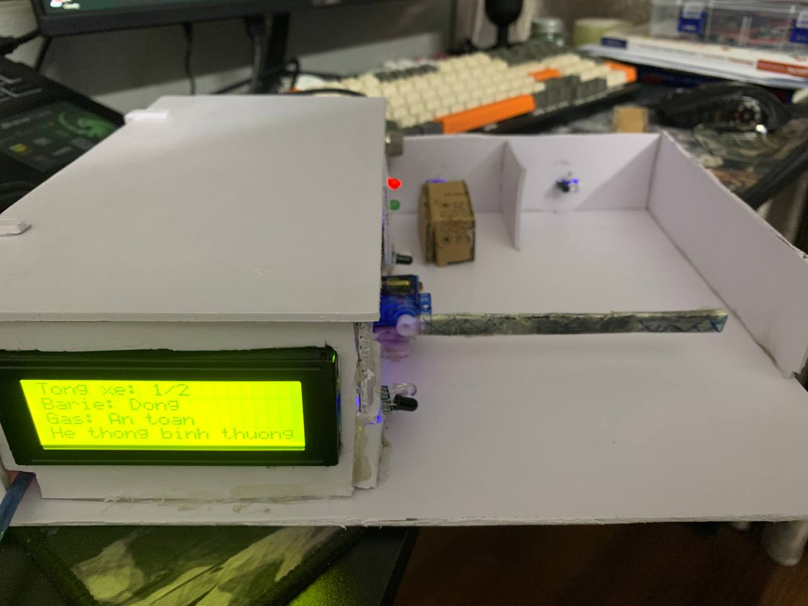
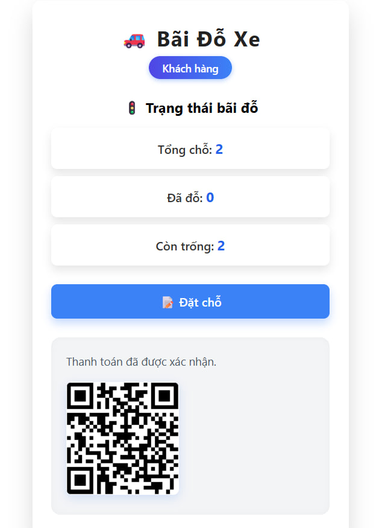
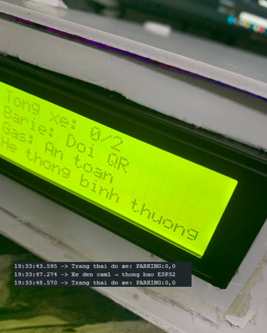
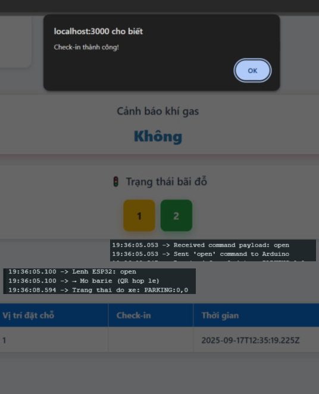
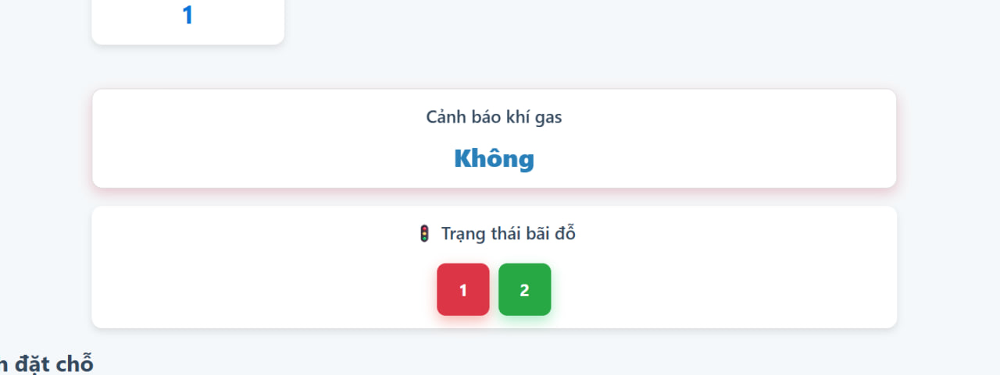
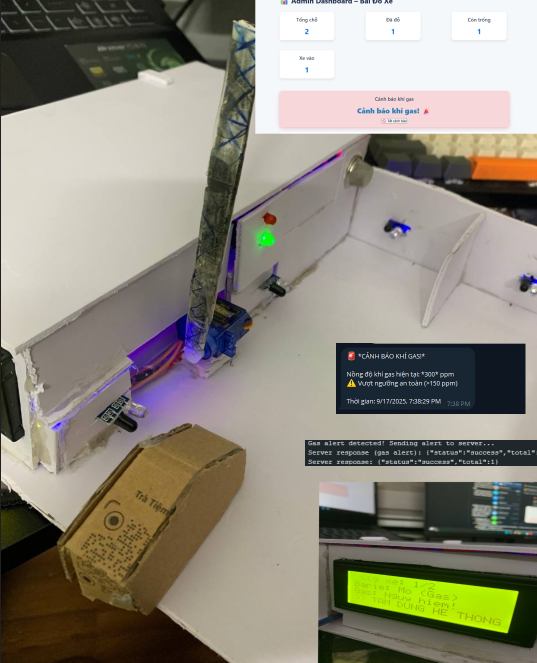

<h1 align="center">
🚗 Dự Án Nhận Diện Bãi Đỗ Xe Thông Minh Có Hệ Thống Giám Sát Online
</h1>
<div align="center">
  
</div>
<br>
<div align="center">

[](https://fitdnu.net/)
[](https://dainam.edu.vn/vi)

</div>


<hr>

<h2 align="center">✨ Mô tả dự án</h2>
<p align="justify">
  Đây là dự án mô phỏng <strong>**BÃI ĐỖ XE THÔNG MINH CÓ GIÁM SÁT ONLINE**</strong> sử dụng **Arduino + ESP32**, kết hợp với **cảm biến hồng ngoại và cảm biến khí gas <strong>ESP32-CAM</strong>. Hệ thống hỗ trợ <strong> khách đặt chỗ trước qua QR code <strong>đồng thời có chức năng **cảnh báo khẩn cấp** khi phát hiện khí gas vượt ngưỡng.</strong>
</p>

<hr>

<h2 align="center">🚀 Cấu trúc dự án</h2>
<pre>
📂 IOT
├── 📁 models/                   # Thư mục chứa các file xử lý dữ liệu (models, slots, người dùng)
├── 📁 node_modules/             # Thư viện được cài thông qua npm
├── 📁 public/                   # Tài nguyên tĩnh phục vụ frontend
│   ├── 🎨 admin-style.css       # Giao diện cho trang quản trị
│   ├── 📄 admin.html            # Giao diện dành cho admin
│   ├── 📄 index.html            # Giao diện dành cho khách hàng
│   └── 🎨 style.css             # CSS dùng chung cho giao diện người dùng
├── 📁 readme/                   # Thư mục chứa tài nguyên liên quan README
│   └── 🖼️ logoDaiNam.png        # Hình ảnh logo dự án
├── 📜 package.json              # Thông tin dự án & các dependencies
├── 📦 package-lock.json         # Khóa version các gói npm
├── 📄 server.js                 # File chính chạy backend Node.js + Express
├── 🔑 serviceAccountKey.json    # Khóa Firebase Admin (bảo mật – không chia sẻ)
├── 📘 README.md                 # Tài liệu mô tả dự án
└── 📝 readme.md                 # Tài liệu mô tả dự án
</pre>


<hr>

<h2 align="center">🎬 Video Demo Hoạt Động Hệ Thống</h2>

<div align="center">
  <a href="https://drive.google.com/file/d/1im_NQEWLpBCS8JXcxpUmRe5tx2diqXFN/view?usp=sharing" target="_blank">
    
  </a>
</div>

<hr>

## Chuẩn bị 
### 🛠️ Phần cứng

<div align="center>

[](#)
[](#)
[](#)
[](#)
[](#)
[](#)
[](#)
[](#)
[](#)


<hr>


### 💻 Phần mềm

### 💻 Phần mềm sử dụng

[](#)
[](#)
[](#)
[](#)
[](#)
[](#)
[](#)
[](#)
[](#)

</div>

<hr>

<h2 align="center">📦 Các thư viện Node.js cần thiết</h2>
<p align="justify">
  <strong>Các gói cần cài đặt:</strong><br>
  - express<br>
  - firebase-admin<br>
  - uuid<br><br>

  <strong>Cài các module cần thiết:</strong><br>
 
  <code>npm install</code><br><br>
  
  <strong>Lệnh cài thư viện:</strong><br>
  - (Tùy chọn) Tạo môi trường ảo (nên dùng <code>nvm</code> hoặc <code>npm init</code>):<br>
  <code>npm init -y</code><br><br>

  - Cài đặt các gói:<br>
  <code>npm install express firebase-admin uuid</code><br><br>

  - <strong>Chạy server:</strong><br>
  <code>node server.js</code>
  <p><em>Lưu ý: Đảm bảo đã cấu hình đúng file <code>serviceAccountKey.json</code> trước khi chạy server.</em></p>
</p>

<hr>

<h2 align="center">🧮 Bảng mạch</h2>
<p align="center">
  ⛓️‍💥 <strong>Hướng dẫn cắm dây:</strong>
</p>

<hr>

<h2 align="center">Cắm các thiết bị</h2>
<div align="center">
  
</div>

<h4 align="center">📡 Cảm biến Gas</h4>
<div align="center">
<table>
  <tr>
    <th>Thiết bị</th>
    <th>Chân</th>
    <th>Giá trị</th>
    <th>Ghi chú</th>
  </tr>
  <tr>
    <td>Cảm biến Gas</td>
    <td>VCC</td>
    <td>5V</td>
    <td>Cấp nguồn cho cảm biến</td>
  </tr>
  <tr>
    <td></td>
    <td>GND</td>
    <td>GND</td>
    <td>Nối đất</td>
  </tr>
  <tr>
    <td></td>
    <td>A0</td>
    <td>A0</td>
    <td>Đọc giá trị gas từ cảm biến (analog)</td>
  </tr>
</table>
</div>

<br>

<h4 align="center">🚗 Cảm biến xe (Cam1 & Cam2)</h4>
<div align="center">
<table>
  <tr>
    <th>Thiết bị</th>
    <th>Chân</th>
    <th>Giá trị</th>
    <th>Ghi chú</th>
  </tr>
  <tr>
    <td>Cam1 (Cảm biến đầu vào)</td>
    <td>OUT</td>
    <td>D2</td>
    <td>Phát hiện xe vào</td>
  </tr>
  <tr>
    <td>Cam2 (Cảm biến đầu ra)</td>
    <td>OUT</td>
    <td>D3</td>
    <td>Phát hiện xe ra</td>
  </tr>
</table>
</div>

<br>

<h4 align="center">📍 Cảm biến vị trí đỗ (Park1 & Park2)</h4>
<div align="center">
<table>
  <tr>
    <th>Thiết bị</th>
    <th>Chân</th>
    <th>Giá trị</th>
    <th>Ghi chú</th>
  </tr>
  <tr>
    <td>Park1</td>
    <td>OUT</td>
    <td>D5</td>
    <td>Phát hiện xe đỗ đúng vị trí đầu tiên</td>
  </tr>
  <tr>
    <td>Park2</td>
    <td>OUT</td>
    <td>D6</td>
    <td>Phát hiện xe đỗ đúng/sai ở vị trí thứ hai</td>
  </tr>
</table>
</div>

<br>

<h4 align="center">🧠 Kết nối Arduino & ESP32 (Giao tiếp Serial)</h4>
<div align="center">
<table>
  <tr>
    <th>Arduino</th>
    <th>ESP32</th>
    <th>Chức năng</th>
  </tr>
  <tr>
    <td>D10 (TX)</td>
    <td>RX</td>
    <td>Truyền dữ liệu từ Arduino sang ESP32</td>
  </tr>
  <tr>
    <td>D11 (RX)</td>
    <td>TX</td>
    <td>Nhận dữ liệu từ ESP32</td>
  </tr>
</table>
<p><i>Sử dụng thư viện <code>SoftwareSerial</code> để giao tiếp giữa Arduino và ESP32</i></p>
</div>

<br>

<h4 align="center">🔩 Servo (Barie)</h4>
<div align="center">
<table>
  <tr>
    <th>Thiết bị</th>
    <th>Chân</th>
    <th>Giá trị</th>
    <th>Ghi chú</th>
  </tr>
  <tr>
    <td>Servo</td>
    <td>VCC</td>
    <td>5V</td>
    <td>Cấp nguồn cho servo</td>
  </tr>
  <tr>
    <td></td>
    <td>GND</td>
    <td>GND</td>
    <td>Nối đất</td>
  </tr>
  <tr>
    <td></td>
    <td>Signal</td>
    <td>D9</td>
    <td>Điều khiển mở/đóng barie</td>
  </tr>
</table>
</div>

<br>

<h4 align="center">💡 Đèn LED trạng thái</h4>
<div align="center">
<table>
  <tr>
    <th>LED</th>
    <th>Chân Arduino</th>
    <th>Màu</th>
    <th>Ghi chú</th>
  </tr>
  <tr>
    <td>LED Đỏ</td>
    <td>D7</td>
    <td>Đỏ</td>
    <td>Bật khi barie đóng hoặc hệ thống nguy hiểm</td>
  </tr>
  <tr>
    <td>LED Xanh</td>
    <td>D12</td>
    <td>Xanh</td>
    <td>Bật khi barie mở</td>
  </tr>
</table>
</div>

<br>

<h4 align="center">📟 Màn hình LCD I2C (20x4)</h4>
<div align="center">
<table>
  <tr>
    <th>Thiết bị</th>
    <th>Chân</th>
    <th>Arduino</th>
    <th>Ghi chú</th>
  </tr>
  <tr>
    <td>LCD I2C</td>
    <td>VCC</td>
    <td>5V</td>
    <td>Cấp nguồn cho màn hình</td>
  </tr>
  <tr>
    <td></td>
    <td>GND</td>
    <td>GND</td>
    <td>Nối đất</td>
  </tr>
  <tr>
    <td></td>
    <td>SDA</td>
    <td>A4</td>
    <td>Dữ liệu I2C</td>
  </tr>
  <tr>
    <td></td>
    <td>SCL</td>
    <td>A5</td>
    <td>Clock I2C</td>
  </tr>
</table>
</div>


<hr>

<h2 align="center">🚀 Hướng dẫn cài đặt và chạy</h2>
<p align="justify">

## I. Chuẩn bị phần Cứng

- 1. **Nạp mã Arduino:**
  - - Mở tệp có tên là Arduino bằng Arduino IDE.
  - Kết nối board Arduino với máy tính.
  - Nạp (upload) mã nguồn lên board.
  - Đảm bảo Arduino xuất hiện trên cổng COM.
- 2. **Nạp mã cho ESP32 với file `Esp32`.**
  - Mở file `ESP32` bằng Arduino IDE.
  - Kết nối board Arduino với máy tính.
  - Nạp (upload) mã nguồn lên board giữ nút boot trên ESP32.
  - Đảm bảo ESP32 xuất hiện trên cổng COM.

## II. CÀI ĐẶT PHẦN MỀM:

### 2.1 Cài đặt Arduino IDE:

- Tải Arduino IDE tại: [Arduino Software](https://www.arduino.cc/en/software)
- Cài đặt Driver CH340 nếu dùng board Arduino clone.
- Cài đặt Driver CP210xVCP cho ESP32.

### 2.2 Cài đặt thư viện cho Arduino:

- Mở Arduino IDE → Library Manager (Ctrl + Shift + I), tìm và cài:
  - `Servo.h` (Điều khiển servo)
  - `SoftwareSerial.h` (Giao tiếp nối tiếp giả lập để kết nối Arduino với ESP32 qua các chân digital 10 và 11)
  - `Wire.h` (Giao tiếp I2C dùng cho màn hình LCD I2C)
  - `LiquidCrystal_I2C.h` (Điều khiển màn hình LCD I2C 20x4)


<hr>

<h2 align="center">Hoạt động của hệ thống</h2>
<div align="center">
  
</div>

---

<p align="justify">
 **1️⃣ Khởi động hệ thống:**

- Bật nguồn cho Arduino, ESP32 và máy tính.
- Mở Serial Monitor (9600 baud) trên Arduino IDE để theo dõi hoạt động.
- Mở Serial Monitor (115200 baud) trên ESP32 để theo dõi hoạt động.
- Chạy Web Server trên PC bằng lệnh: `node server.js`

---

## III. Quy trình hoạt động:

1. **Khởi động hệ thống**
   - Màn hình LCD hiển thị thông báo "Khởi động hệ thống".
   - Barie ở trạng thái đóng (servo ở góc 0 độ).
   - Các cảm biến và LED được thiết lập trạng thái ban đầu.

2. **Phát hiện khí gas nguy hiểm**
   - Cảm biến khí gas (chân A0) liên tục đo giá trị khí trong không khí.
   - Nếu giá trị vượt ngưỡng cao (`gasThresholdHigh`), hệ thống cảnh báo nguy hiểm:
     - Mở barie (servo xoay góc 90 độ).
     - Bật còi báo động.
     - Gửi tín hiệu cảnh báo `GAS_ALERT` đến ESP32.
     - LCD hiển thị trạng thái khí gas "Nguy hiểm" và barie "Mở (Gas)".
     - Gửi thông báo cảnh báo về Telegram.
   - Khi giá trị khí gas giảm dưới ngưỡng thấp (`gasThresholdLow`), hệ thống tắt cảnh báo, đóng barie, tắt còi, và LCD hiển thị trạng thái an toàn.

3. **Phát hiện xe đến (Cảm biến Cam1)**
   - Khi cảm biến Cam1 (chân 2) phát hiện xe (tín hiệu LOW), nếu bãi chưa đầy:
     - Gửi tín hiệu `"XE_DEN"` cho ESP32 để yêu cầu quét QR.
     - Barie giữ trạng thái đóng, LCD hiển thị "Đợi QR".
   - Nếu bãi đã đầy theo dữ liệu đặt trước từ ESP32, còi sẽ báo hiệu từ chối xe.
4. **Mở barie cho xe hợp lệ**
   - Khi nhận được lệnh `open` từ ESP32 (sau khi xác nhận QR hợp lệ), barie sẽ mở.
   - Xe đi vào qua cảm biến Cam2 (chân 3).
   - Khi xe qua Cam2 hoàn toàn, barie tự động đóng lại.
   - Số xe trong bãi tăng lên 1, trạng thái được gửi về ESP32 và hiển thị trên LCD.

5. **Xe ra khỏi bãi**
   - Khi phát hiện xe đi ra tại cảm biến Cam2 (và số xe > 0), barie sẽ mở.
   - Xe đi qua cảm biến Cam1 ra khỏi bãi, barie đóng lại.
   - Số xe trong bãi giảm 1, trạng thái gửi về ESP32 và cập nhật trên LCD.

6. **Kiểm tra vị trí đỗ xe và còi cảnh báo**
   - Hai cảm biến đỗ xe (`park1` và `park2`) theo dõi vị trí xe đỗ.
   - Nếu xe đỗ sai vị trí (ví dụ `park2` có xe nhưng số xe trong bãi chưa đủ 2), còi báo động sẽ được kích hoạt để cảnh báo.

7. **Gửi trạng thái đỗ xe định kỳ**
   - Mỗi 5 giây, hệ thống gửi trạng thái chỗ đỗ xe (cảm biến `park1`, `park2`) về ESP32 để theo dõi và hiển thị.
   - Arduino nhận kết quả và điều khiển động cơ, servo.

</p>

<hr>

<h2 align="center">Giải thích code</h2>
<p align="justify">
  # Hệ Thống Quản Lý Bãi Đỗ Xe với Arduino và ESP32

## IV. Mô tả hệ thống

### 1. Arduino Code (`arduino.ino`)

- **Khởi tạo:**
  - Serial tốc độ 9600.
  - Sử dụng các thư viện: `Servo.h`, `SoftwareSerial.h`, `Wire.h`, `LiquidCrystal_I2C.h`.
  - Cấu hình chân kết nối:
    - Cảm biến xe: `cam1` (D2), `cam2` (D3).
    - Cảm biến vị trí đỗ: `park1` (D5), `park2` (D6).
    - Cảm biến khí gas: Analog A0.
    - Còi cảnh báo: D8.
    - LED báo trạng thái: Đỏ (D7), Xanh (D12).
    - Servo điều khiển barie: D9.
  - Giao tiếp với ESP32 qua UART mềm: `SoftwareSerial(10, 11)`.
  - Hiển thị thông tin qua màn hình LCD I2C (`LiquidCrystal_I2C`).

- **Vòng lặp chính:**
  - Đọc dữ liệu cảm biến:
    - Đọc giá trị khí gas từ analog A0.
    - Đọc trạng thái cảm biến cam1, cam2 để xác định xe đến/đi.
    - Đọc trạng thái cảm biến đỗ xe park1, park2.
  
- **Xử lý dữ liệu & hành động:**
  - **Phát hiện khí gas:**
    - Nếu nồng độ khí gas vượt ngưỡng → mở barie, bật còi, gửi `"GAS_ALERT"` đến ESP32.
    - Nếu khí gas giảm → đóng barie, tắt còi.
  - **Nhận lệnh từ ESP32:**
    - `"open"` → mở barie, cho xe vào.
    - `"beep"` → bật còi cảnh báo đỗ sai.
    - `"stopbeep"` → tắt còi.
  - **Xử lý xe vào (qua cam2):**
    - Khi xe đi qua cam2 sau khi barie mở → đóng barie, tăng biến đếm `soXe`, gửi `"SOXE:x"` về ESP32.
  - **Xử lý xe ra (qua cam2 → cam1):**
    - Khi có xe đi ra (cam2 LOW rồi qua cam1) → mở barie, giảm `soXe`, gửi `"SOXE:x"` về ESP32, đóng barie sau khi xe đi qua.
  - **Kiểm tra đỗ sai:**
    - Nếu có xe ở `park2` nhưng `soXe < 2` → báo đỗ sai, bật còi cảnh báo.
    - Nếu xe đỗ đúng hoặc đi khỏi → tắt còi.
  - **Gửi trạng thái định kỳ:**
    - Gửi trạng thái chỗ đỗ xe định kỳ (ví dụ `"PARKING:x,y"`) mỗi 5 giây về ESP32.

---

### 2. ESP32 Code (`esp32.ino`)

- **Khởi tạo:**
  - Serial tốc độ 115200.
  - Kết nối WiFi (SSID).
  - Cấu hình UART giao tiếp với Arduino (`RX: D16`, `TX: D17`).
  - Thiết lập server với các endpoint:
    - `POST /fromarduino`: nhận dữ liệu từ Arduino.
    - `GET /command`: lấy lệnh từ server.
    - `POST /commands/reset`: reset lệnh.

- **Vòng lặp chính:**
  - Nhận dữ liệu từ Arduino:
    - `"GAS_ALERT"` → gửi báo động gas lên server.
    - `"SOXE:x"` hoặc `"Tong xe: x"` → cập nhật số xe.
    - `"PARKING:x,y"` → cập nhật trạng thái các slot.

- **Gửi dữ liệu lên server:**
  - Khi cập nhật trạng thái bình thường:
    ```json
    {
      "event": "update",
      "total": x,
      "slots": [2, 0]
    }
    ```
  - Khi phát hiện báo động khí gas:
    ```json
    {
      "event": "gas_alert",
      "total": x,
      "slots": [2, 0],
      "gas": 300
    }
    ```

---

## 3. Chú ý

- Tham số `x` đại diện cho số lượng xe hiện tại.
- Các giá trị trong `slots` đại diện trạng thái chỗ đỗ (ví dụ: số xe đỗ tại các vị trí).
- Giá trị `"gas": 300` chỉ mang tính minh họa, thực tế lấy từ cảm biến gas.

  ---

### 4. Xử lý điều kiện còi cảnh báo

- Nếu `slot2 = 2` và `slot1 ≠ 2` → được xem là đỗ sai chỗ.
- Khi phát hiện đỗ sai, gửi lệnh `"beep"` cho Arduino **một lần duy nhất** để bật còi cảnh báo.
- Nếu điều kiện đỗ sai không còn tồn tại, tắt chế độ cảnh báo và đặt biến `beepSent = false` để sẵn sàng phát hiện lần sau.

### 5. Kiểm tra lệnh từ server

- ESP32 gửi yêu cầu `GET /command` đến server mỗi 3 giây để lấy lệnh điều khiển.
- Nếu server trả về lệnh `"open"` → ESP32 gửi lệnh `"open"` về Arduino để mở barie cho xe vào.
- Sau khi xử lý lệnh, ESP32 gửi `POST` rỗng đến `POST /commands/reset` để reset trạng thái lệnh trên server.

---

## V. Node.js & Firebase Code (`server.js`)

### 1. Khởi tạo

- Server Express chạy tại địa chỉ: `http://localhost:3000/`.
- Kết nối Firebase Realtime Database sử dụng Admin SDK thông qua file cấu hình `serviceAccountKey.json`.
- Khởi tạo dữ liệu mặc định cho trạng thái bãi đỗ và log khí gas nếu chưa tồn tại trong cơ sở dữ liệu.

### 2. Xử lý dữ liệu từ ESP32/Arduino

- Nhận dữ liệu từ ESP32/Arduino gửi lên mỗi 5 giây qua route `POST /fromarduino`.
- Dữ liệu nhận gồm:
  - `event`: loại sự kiện (ví dụ: `"update"`, `"gas_alert"`).
  - `total`: tổng số xe hiện có.
  - `slots`: trạng thái các vị trí đỗ.
  - `gas`: nồng độ khí gas (nếu có).
- Cập nhật số xe ra/vào, trạng thái từng chỗ đỗ trong Firebase.
- Ghi lại log khí gas, giới hạn tối đa 20 bản ghi gần nhất.
- Nếu phát hiện nồng độ khí gas vượt ngưỡng 150 ppm, kích hoạt cảnh báo Telegram.
- Khi khí gas trở lại mức an toàn, gửi thông báo khôi phục qua Telegram.

### 3. Giao tiếp với Arduino qua API

- `GET /command`: Arduino/ESP32 gọi định kỳ để lấy lệnh điều khiển.
  - Server trả về lệnh `"open"`, `"beep"` hoặc rỗng.
- `POST /commands/reset`: Reset lệnh sau khi Arduino/ESP32 đã xử lý xong.

### 4. Chức năng Đặt chỗ và Thanh toán

- `POST /pre-reserve`: Đặt chỗ trước với thông tin tên, biển số xe, vị trí slot.
- `POST /confirm-payment`: Xác nhận thanh toán cho đặt chỗ.
- `GET /check-payment`: Kiểm tra trạng thái thanh toán và trả về mã QR tương ứng.

### 5. Check-in bằng QR Code

- `POST /checkin`: Nhận mã QR từ người dùng.
- Kiểm tra tính hợp lệ của mã QR, đánh dấu checkin và cập nhật trạng thái slot chiếm dụng.
- Nếu xe đầu tiên đỗ vào slot số 2, gửi lệnh `"beep"` đến Arduino để cảnh báo đỗ sai.

### 6. Quản lý trạng thái bãi đỗ

- `GET /status`: Trả về toàn bộ trạng thái bãi đỗ gồm tổng chỗ, số chỗ còn trống, số xe vào, cảnh báo khí gas, v.v.
- `POST /reset-xevao`: Đặt lại số lượng xe hiện tại về 0 hoặc giá trị mặc định.

### 7. Quản lý Đặt chỗ

- `GET /reservations` và `GET /bookings`: Lấy danh sách các đặt chỗ và đặt trước.
- `DELETE /reservations/:id`: Xóa đặt chỗ theo ID.

### 8. Cảnh báo khí gas

- Tự động gửi cảnh báo qua Telegram khi nồng độ khí gas vượt ngưỡng an toàn (>150 ppm).
- `POST /dismiss-gas-alert`: Cho phép người dùng tắt cảnh báo khí gas thủ công.

### 9. Xem lịch sử khí gas

- `GET /logs`: Trả về 20 bản ghi khí gas gần nhất để hiển thị trên trang web hoặc giao diện admin.

### 10. Giao diện web

- **Khách hàng:**
  - Cho phép đặt chỗ và thanh toán, nhận mã QR khi được admin xác nhận.
- **Admin:**
  - Truy cập `/admin` để quản lý toàn bộ bãi đỗ: giám sát trạng thái bãi đỗ, đặt chỗ, cảnh báo, và quét mã QR.

### 11. Thông báo Telegram (Real-time)

- Gửi tin nhắn cảnh báo khi phát hiện khí gas vượt ngưỡng (>150 ppm).
- Gửi tin nhắn khi khí gas trở lại mức an toàn.


<hr>

<h2 align="center">📸 Kết quả hiển thị</h2>
<div align="center">
  <p><strong>Tổng quan Mô hình</strong></p>
  
  
  <p><strong>Đặt chỗ</strong></p>
  
</div>

  <p><strong>Xe Vào</strong></p>
  
</div>

<p><strong>Quét QR thành công Server trả về Open cho Esp32</strong></p>
  
</div>

<p><strong>Xe đỗ vị trí 1 nhận diện gửi lên Server đổi màu ô đỗ</strong></p>
  
</div>

<p><strong>Cảnh báo khí GAS</strong></p>
  
</div>

<br>
<hr>


<br>
<hr>

<h2 align="center">🤝</h2>
<p>Dự án được phát triển bởi:</p>
<center>
<table>
  <thead>
    <tr>
      <th>Giảng viên hướng dẫn</th>
    </tr>
  </thead>
  <tbody>
    <tr>
      <td>Thầy Nguyễn Văn Nhân</td>
    </tr>
  </tbody>
</table>
</center>

<center>
<table>
  <thead>
    <tr>
      <th>Họ và Tên</th>
      <th>Mã sinh viên</th>
      <th>Vai trò</th>
    </tr>
  </thead>
  <tbody>
    <tr>
      <td>Ngô Tuấn Minh</td>
      <td>1571020175</td>
      <td>Phát triển dự án</td>
    </tr>
  </tbody>
</table>
</center>


<p align="center">© 2025 NGÔ TUẤN MINH, CNTT16-06, TRƯỜNG ĐẠI HỌC ĐẠI NAM</p>

